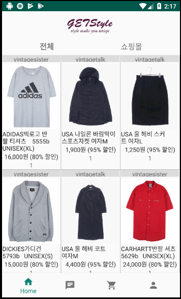
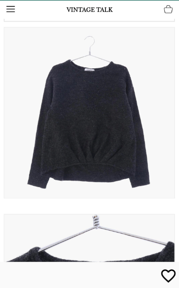
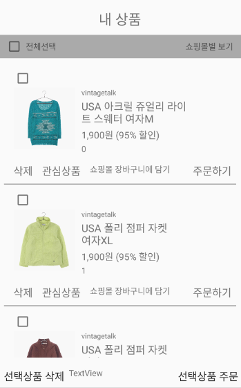
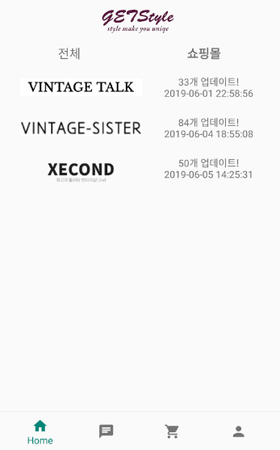
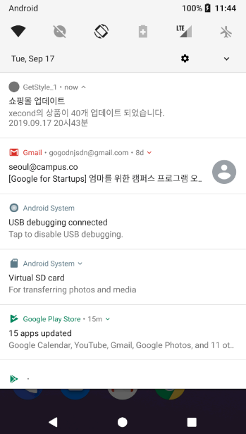
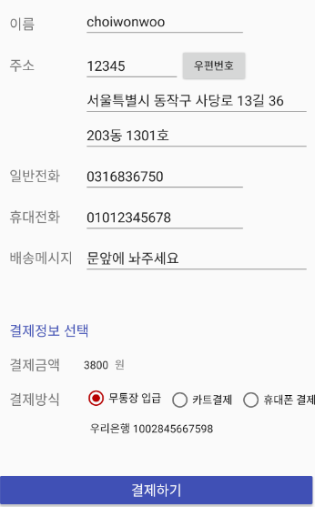
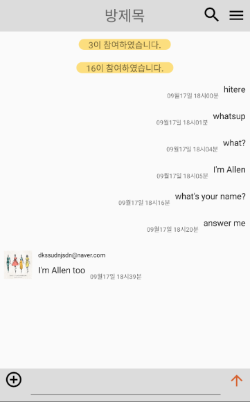
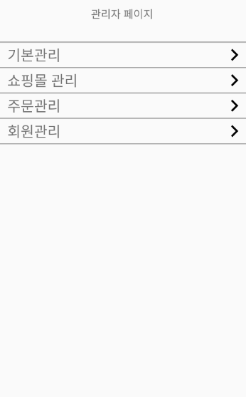

# GetStyle - Android App
이 프로젝트는 여러소핑몰의 상품을 하나의 앱에서 볼 수 있는 앱 프로젝트 입니다.
이 Repository 는 FrontEnd 만 포함합니다.

## 프로젝트 소개

여러 쇼핑몰의 상품을 하나의 앱에서 볼 수 있는 앱입니다. ( Like 지그제그 )
        

**기능**

1. 로그인
2. 회원가입
3. 메인페이지(상품리스트 페이지)
4. 상품업데이트 알림
5. 상품상세페이지
6. 장바구니
7. 주문하기
8. 주문정보 상세보기
9. 오픈채팅방
10. (관리자) 제휴 쇼핑몰 관리
11. (관리자) 회원관리
12. (관리자) 주문관리

## 제작정보
개인프로젝트

## 사용기술
> FrontEnd
* AndroidStudio ( Android 8.0 ) - Java
* SQLite (inner DB )
* Retrofit (HttpRequset)
* Jsoup ( Crawling )
* Picasso ( Image Processing )
> BackEnd
* Main Service Server
	* AWS-EC2[Apache, PHP, MySQL]
	* FCM ( push alert )
* Crawling Server - Python
	* Requset/BeautifulSoup
* Chatting Server - Java
	* Echo Server

## 필수조건 안내
* Java 8 이상이 필요합니다.
* AndroidStudio 설치 권장
	* 라이프러리와 패키지는 Gredle을 통해 관리합니다.

## 설치 안내
클론을 통해서 받아서 사용하면 됩니다.

## 실행방법
 1. Android Studio 에서 Git을 통해 코드를 다운받는다.
 2. 라이블러리 설치가 끝나면 RunApp을 한다.
 3. 앱을 빌드하고 실행시킬 기기를 고른다. ( 애뮬레이터 or PC와 연결된 Android 기기 )

## 저작권
Allen Choi
[https://github.com/AllenChoiwonwoo](https://github.com/AllenChoiwonwoo)
